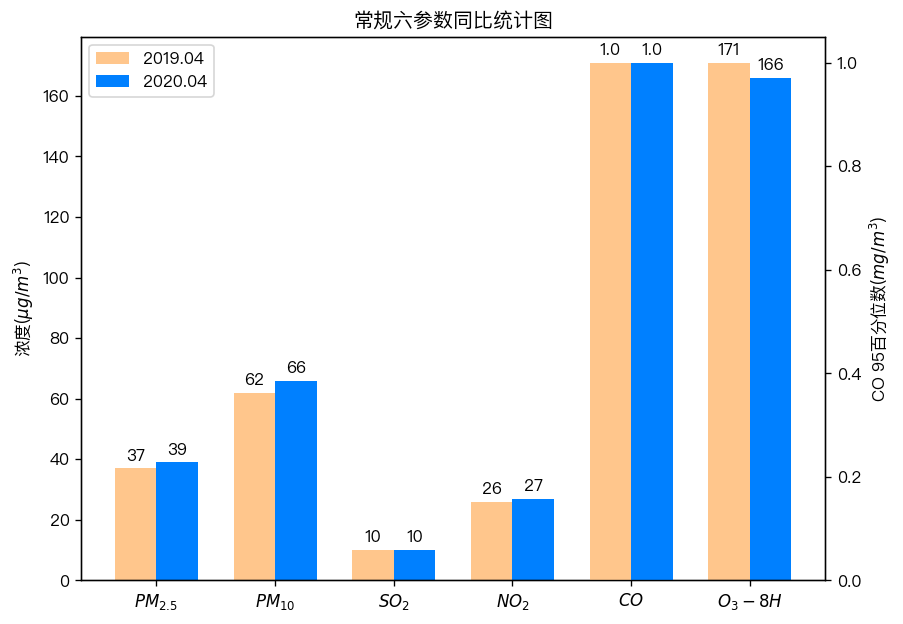

<!--
 * @Author: sandwich
 * @Date: 2020-07-28 09:05:08
 * @LastEditTime: 2020-07-28 14:32:33
 * @LastEditors: sandwich
 * @Description: 工作绘图开源文档
 * @FilePath: /DataScience/PlotInWork/README.md
--> 
# 日常工作中的绘图-Python实现

该仓库主要整理工作中常见的绘图工作，当需要进行数据批量绘图时可以结合数据批处理实现。部分产品数据使用模拟数据实现，开源绘图代码。权作整理汇总之用。代码用`jupyter`支持。
## 常规绘图
### 时间序列绘图
### 柱形图
### 组分饼图
***
## 非常规绘图
### 双Y轴同比柱状图
+ :fire:CO独立一个Y轴，不至于信息被遮挡
+ :rocket:实现柱状图数据标记
+ :basketball:在标签及其他文本中使用`latex`表述

## 地理绘图
## 动态绘图
## tips